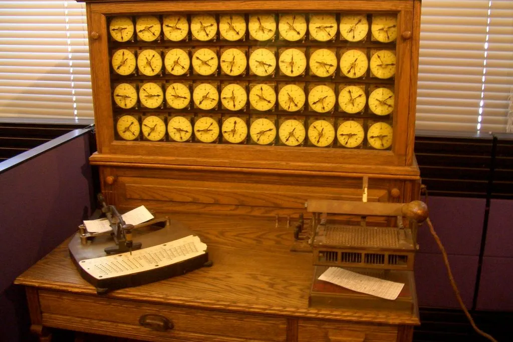
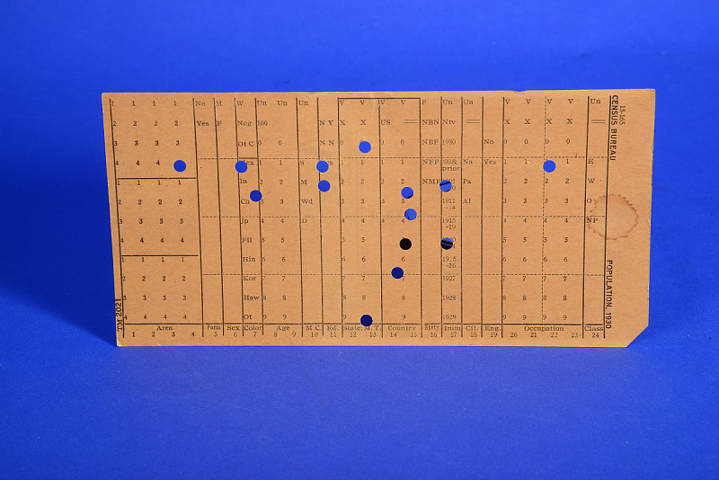
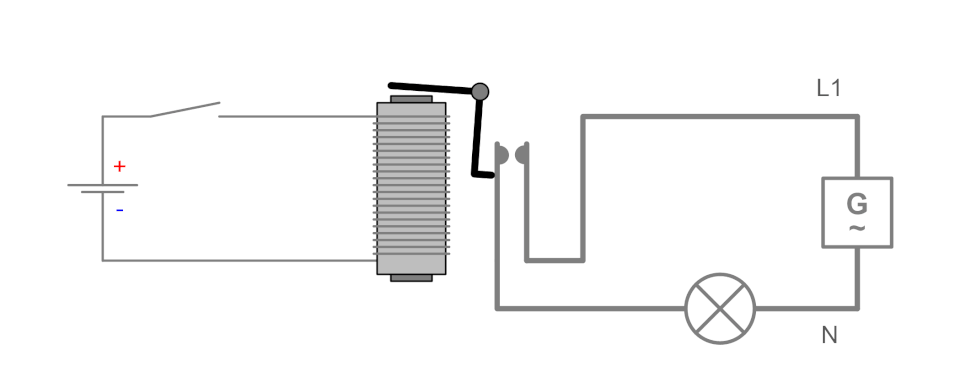
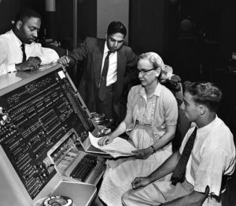
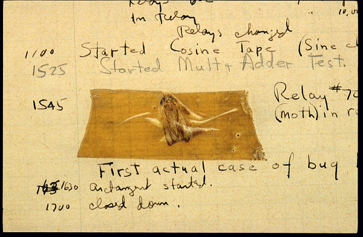
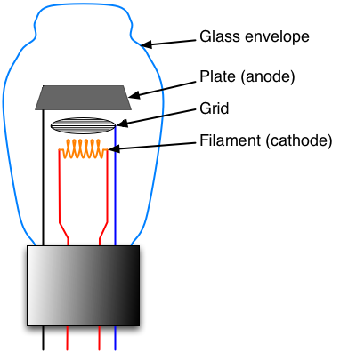
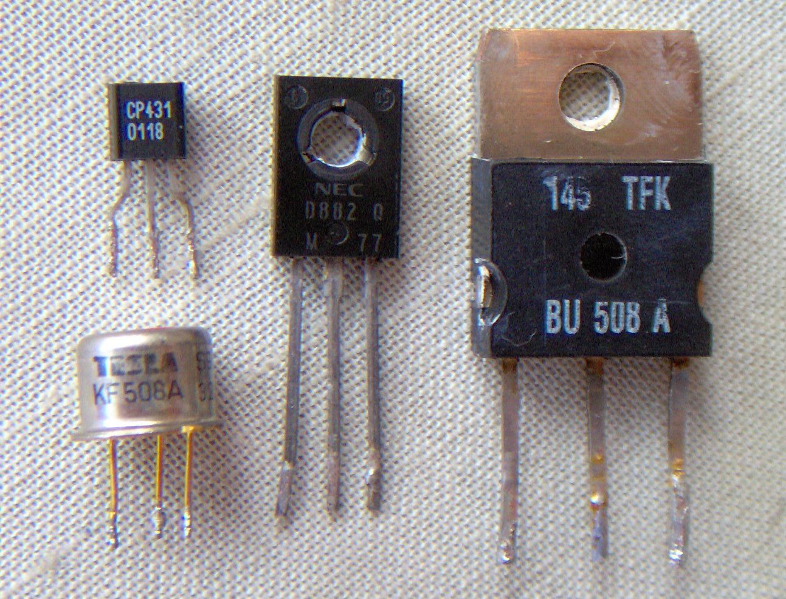
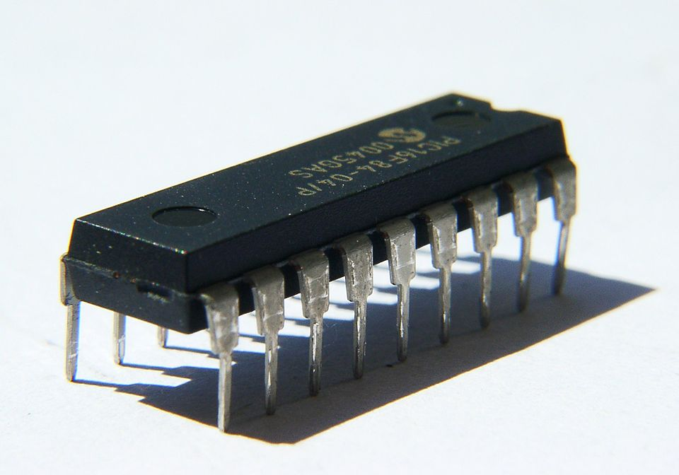

# 00.015 A Bit of History

In this vide we are going to look at history, and also talk about what a "bit" is.

## 1890s Herman Hollerith and the Tabulating Machine

Notice that the holes are a binary representation.  There is a hole, or there is not a hole.

## Binary Coded Decimal

Binary Representation|Decimal Digit
:---:|:---:
0000|0
0001|1
0010|2
0011|3
0100|4
0101|5
0110|6
0111|7
1000|8
1001|9
1010|10

### Unused or wasted BCD "bit space"

Binary Representation|Decimal Digit
:---:|:---:
1011| ???
1100| ???
1101| ???
1110| ???
1111| ???

## Unit Record Equipment -- 1900 - 1950s and beyond

Hollerith adapted his equipment for general business purposes.  He started a company with merged with another business in 1924 to form "International Business Machines" or IBM.

Unit Record Equipment used punched cards.  They included several components:

* Card Punches
* Card sorting machines
* Tape drives
* Accumulators that could count and do simple math using BCD.

[Unit Record Equipment](https://www.google.com/search?q=unit+record+equipment&oq=unit+record+equipment&gs_lcrp=EgZjaHJvbWUqDggAEEUYJxg7GIAEGIoFMg4IABBFGCcYOxiABBiKBTIGCAEQRRhAMgoIAhAAGIAEGKIEMgcIAxAAGO8FMgcIBBAAGO8FMgYIBRBFGDwyBggGEEUYPNIBCDU0MTdqMGo3qAIIsAIB8QVJDTPU-keohg&sourceid=chrome&ie=UTF-8)

## Calculating Machines -- WW II, early 1940s

### Relays

### Grace Hopper and Mark I

### Relay, Grace Hopper, and a Bug

## Each Relay Represented 1 Bit

A bit is a Binary Digit.  It is a 0 or a 1.

Most of the WWII calculators used BCD.

## Late 1940s 

Experimental, one of a kind computers such as ENIAC

Generally used Vacuum Tubes

Vacuum Tubes are called "Valves" in England.  They may be used like a relay switch to be on or off.  

- Vacuum Tubes are faster than relays
- Vacuum Tubes don't get moths stuck in them
- Each tube has its own little heater; they take a lot of electricity.
- Tubes are more reliable than relays, but they still burn out.

[Univac I and Walter Cronkite](https://www.computerhistory.org/tdih/november/4/)

## Transistors 1950s, 2nd computer generation

Transistors are solid state versions of vacuum tubes.

- No heater
- Small (the metal one in the picture is about the size of a pencil eraser)
- Each transistor replaces a vacuum tube

Transistors solved the "speed of light problem" for computers, at least for a while.

## Integrated Circuits -- 1960s, Third Generation

Integrated circuits put many transistors onto one chip.  

- The IC would be contain things like AND Gates or memory units.
- The IC uses less power and is smaller
- Addressed the speed of light problem again

## Micro Processors -- 1980s onward 

