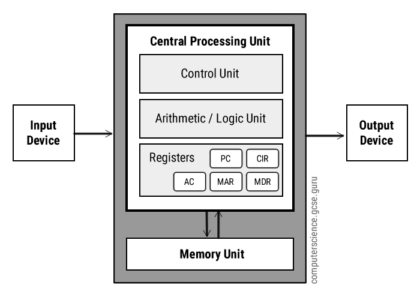
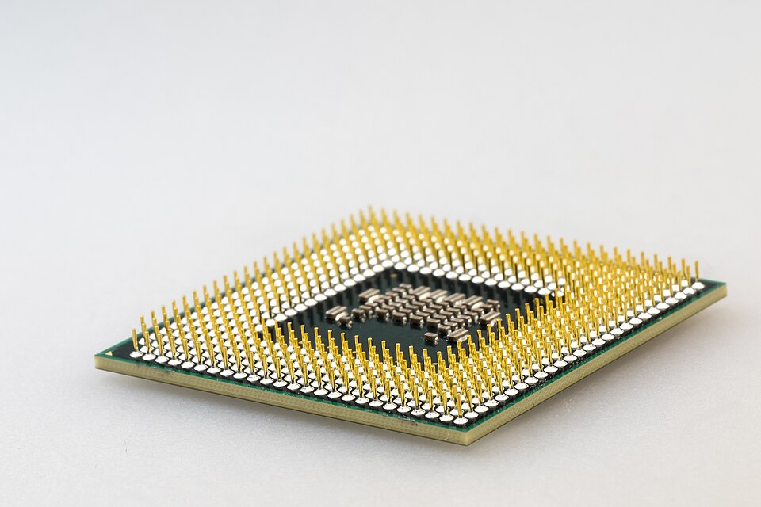
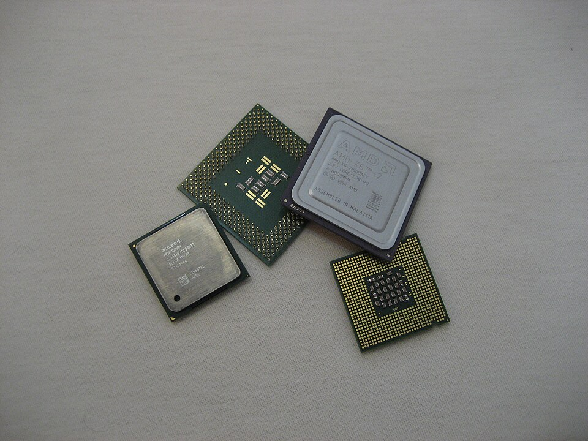
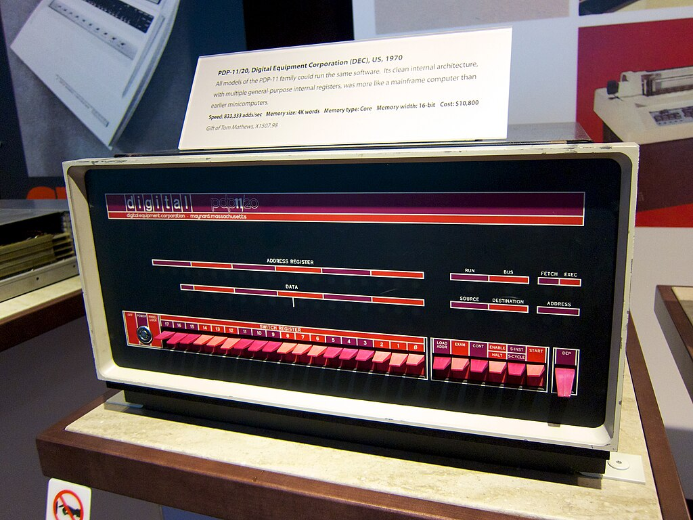

# 01.020 Computer Systems

## Von Neuman Architecture

## CPU

## Memory Unit

Memory is also known as RAM.  

Memory is organized by addresses.

## Buses

A Buss is a connection path between parts of the computer.  There is usually an Address Bus and a Data Bus between the CPU and the Memory Unit.

## Input/Output

Different types of VonNeumann computers handle I/O differently.  Sometimes they have their own busses, but some systems just treat I/O as if they are special memory addresses