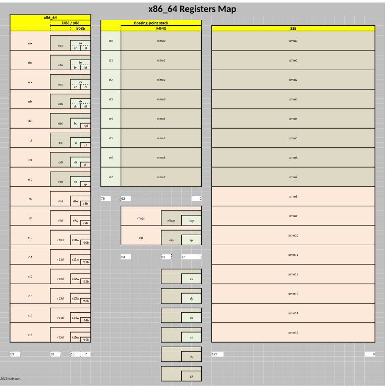

# 00.030 Computer Architectures

Computer Architecture refers to how the components of the computer CPU are organized.  It includes things like what registers are available, how logical flags are arranged, and how memory is accessed by the CPU.

Most modern digital computers use VonNeumann architecture.  However, the way they structure registers and busses (connections to the outside world) vary.

The following diagram illustrates some aspects of the x86-64 architecture.

## Some popular computer architectures

* x86 This is the family of CPUs that most Window Computers use.  It also is the basis for many Mac and Linux systems.
  * The current form is 64-bit.  There have been 16 and 32 bit versions.
  * Both Intel and AMD make processors that use this architecture
* ARM This is the family of CPUs that run portable devices like cell phones, tablets, and Raspberry Pi.
* PowerPC was produced by Apple for use in older Mac computers.
* PDP-11 is an obsolete architecture.  Unfortunately, you will hear a lot about it because your instructor has an unnatural affection for PDP-11 systems.

## Instruction Set Architecture (ISA)

Instruction Set Architecture is a specification about how the machine language works for a particular architecture.  

Each architecture has its own ISA.  One way to think of the ISA is that it is the set of instructions that the CPU knows how to do at the machine level.

For example, ADD is a common instruction on most CPUs.  Almost all CPUs will allow you to add the contents of one register to another register.  However, different ISAs will allow ADD to work on specific registers.  Different ISAs will store the results of additions in different places.  Some ISAs may allow you to ADD the contents of a memory location to a register.  

Most modern ISAs will have certain instructions in common, but they will be implemented with different options and ways of working.

## Every different ISA has a different form of Assembly Language

Assembly code written for one ISA must be rewritten for other ISAs.  However, all ISAs are doing about the same thing, so if you know one form of assembly language, it is usually fairly easy to learn another one.
