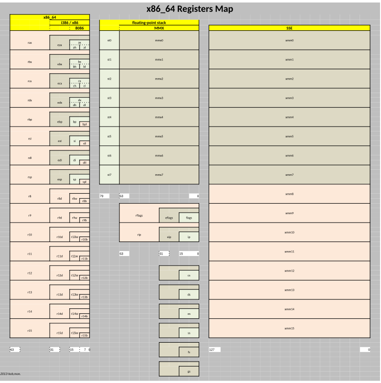

# 00.080 Generations of x86 Architecture

The x86 architecture has evolved through several generations, each introducing new features and improvements. Below is a brief overview:

Collectively, they are referred to as x86.

## 0. 8080 Processors (Precursor to the x86 line)

## 1. 8086 and 8088 (1978–1979)
- 16-bit processors
- 20-bit address bus (1 MB memory)
- No built-in floating-point unit  -- They could only add and do bit manipulation  There was a separate 8087 floating point chip you could add.

## 2. 80286 (1982)
- 16-bit processor
- 24-bit address bus (16 MB memory)
- Introduced protected mode

## 3. 80386 (1985)
- 32-bit processor
- 32-bit address bus (4 GB memory)
- Virtual memory support

## 4. 80486 (1989)
- Integrated FPU (floating-point unit)
- Improved performance and pipelining

## 5. Pentium Series (1993+)
- Superscalar architecture (multiple instructions per cycle)
- MMX technology for multimedia

## 6. Pentium Pro, II, III, 4 (1995–2000)
- Out-of-order execution
- SIMD extensions (SSE, SSE2)

## 7. 64-bit Extensions (x86-64, 2003+)
- 64-bit registers and addressing
- Backward compatibility with 32-bit code

## 8. Modern x86 (Core, Xeon, Ryzen, etc.)
- Multi-core processors
- Advanced power management
- Hardware virtualization

## Consequences

Each generation treats the previous generations as subsets.  You can see the original registers buried in the architecture.

[Link to the original .svg image](https://commons.wikimedia.org/wiki/File:X86_64-registers.svg)

---

**References:**
- [Intel x86 Architecture](https://en.wikipedia.org/wiki/X86)
- [CPU Generations Explained](https://www.intel.com/content/www/us/en/processors/processor-numbers.html)