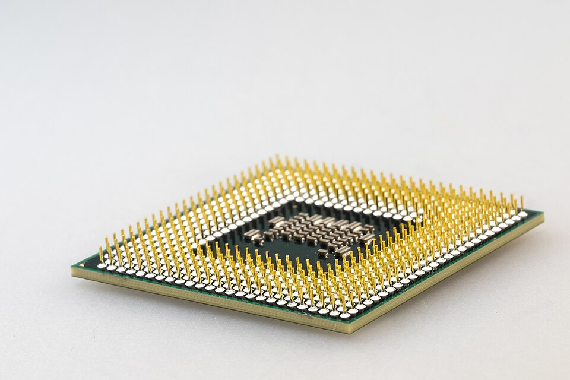
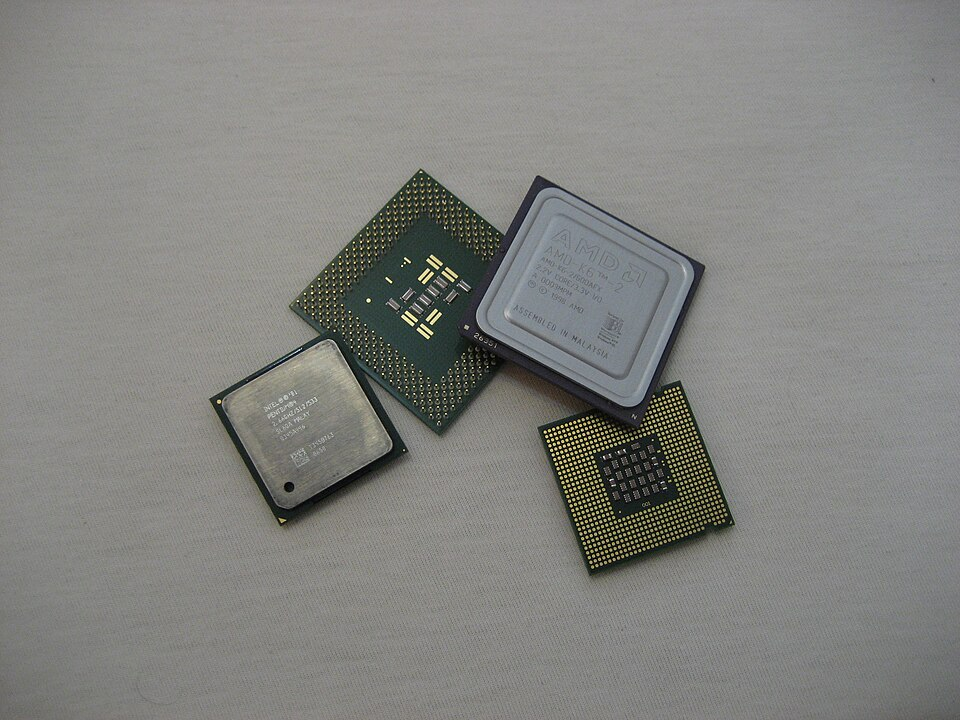
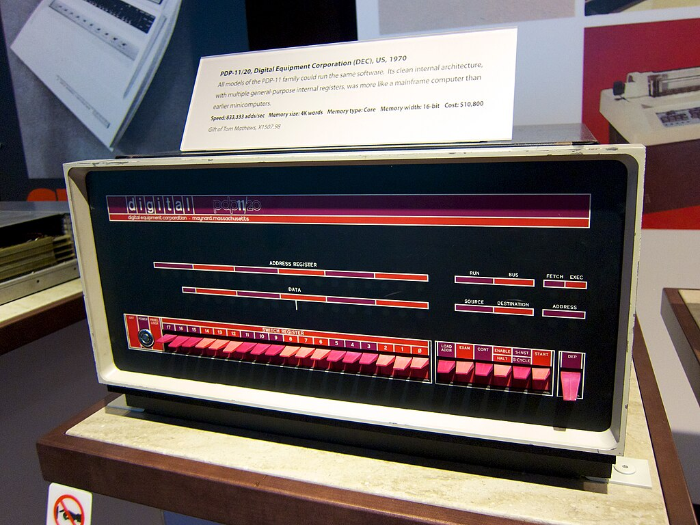

# 01.020 Deeper Dive into Assembler

## High Level Languages

* Java
* Python
* C
* C++
* C#
* Basic
* COBOL
* FORTRAN

High level languages are designed to be easy for humans to use.  The first two successful high level languages were FORTRAN and COBOL.  FORTRAN was designed to make it easy for scientists to translate formulas to computer languages.  COBOL was designed so that financial auditors could read the code without knowing how to program.

High level languages (especially modern ones) are independent of the computer they run on. Most Java code will run on a PC, Mac or Linux.  

Compilers and Interpreters are programs that convert high level languages to object code that may be run on the computer.

## Machine Language

Machine language is the lowest programmable level above the hardware (Some computers have ***microcode*** below the machine language, but microcode is more in the realm of electrical engineering.)

Machine language speaks the language of the CPU of the computer you are running on.  Each CPU uses a specific machine language.  We will be using the machine language used on popular processors by AMD and Intel. 

Machine Language is talking directly to the CPU.  If it wants to do something like I/O or get more RAM, it has to request the Operating System to do the operation.

Machine Language|Hexadecimal Notation|Assembler Language
:---:|:---:|:---:
01001000 00000001 11000111|48 01 C7|addq %rax, %rdi

Machine language is written in 0s and 1s.  In the earliest computers, this related to "off" and "on."  On modern computers, 0 and 1 refer to low voltage and high voltage.

Hexadecimal, or "hex" is a shorthand for writing the 0s and 1s.  "01001000" is written as 48.  The 48 is easier for humans to remember, and it is less prone to making errors.

