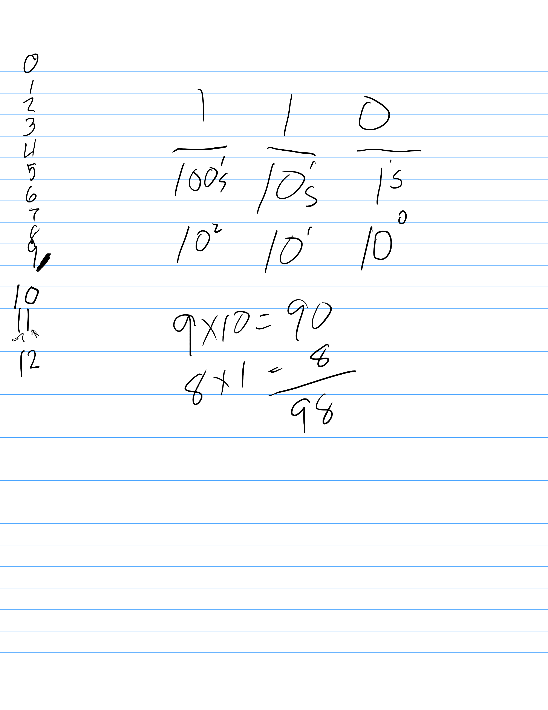
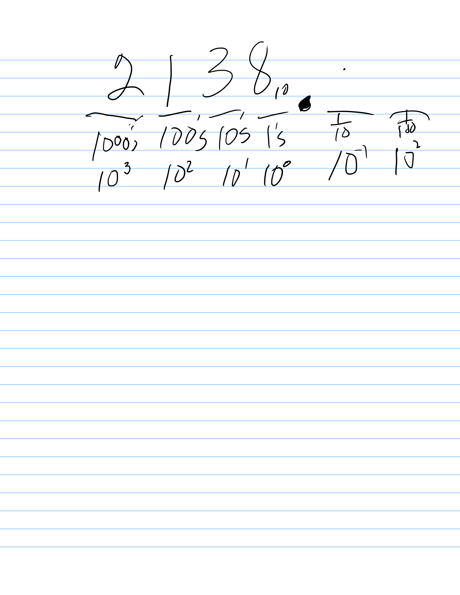

# 01.010 Decimal Number System

This is our "normal" number system that is used in most of the modern world.

## Base 10 has 10 digits

The digits are 0,1,2,3,4,5,6,7,8,9.  ***There is no symbol for "ten."  To represent the idea of ten we write "10."  

## Positional Number Systems

Our modern system is a positional number system.  The position of each digit Consider the number 2138.  The 2 is in the 4th position from the right which is called the "thousands" position. It represnes "two thousand" The 1 is third digit from the right, so it is in the hundreds position. There is a 1, so this represnes "one hundred"  The three is in the 10s position, so it represents "thirty."  Finally, there is an 8 in the 1s postion, so it has a value of eight.  Adding them together we get:

```text
     2000
      100
       30
     +  8
     ____
     2138
```

2 | 1 | 3 | 8
:---:|:---:|:---:|:---:
thousands|hundreds|tens|ones
1000|100|10|1
$10^3$ | $10^2$|$10^1$|$10^0$

## Algebra review

* $a^3 = 1 \cdot a \cdot a \cdot a$
* $a^2 = 1 \cdot a \cdot a$
* $a^1 = 1 \cdot a$
* $a^0 = 1$



