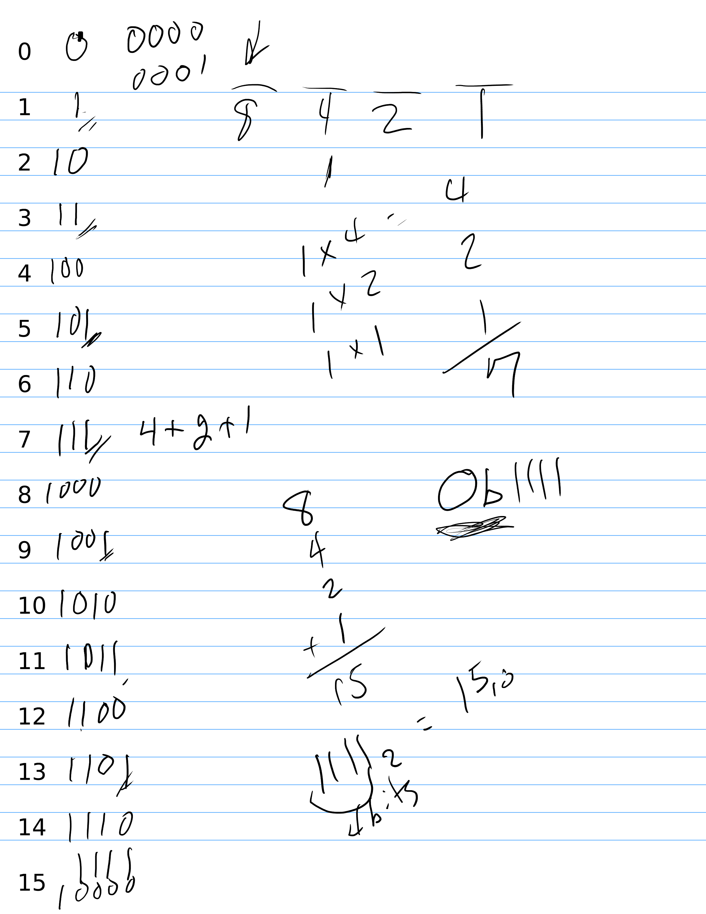

# 01.030 Base 2 Number System (Binary)

Base 2 is critical to understand.  You need to be able to convert between Base 2 and Base 10 as well as to directly translate between Base 2 and Base 16.  I will also expect you to be able to do conversions between Base 2 and Octal

Base 2 is looks the weirdest, but in many ways it is the easiest.  Many people can do Base 2 to Base 10 conversions in their heads.

You will need to know the powers of 2 up through at least $2^8$.  You will probably learn to recognize them all the way out to $2^{16}$.

## Algebra review

* $2^8 = 1 \cdot 2 \cdot 2 \cdot 2 \cdot 2 \cdot 2 \cdot 2 \cdot 2 \cdot 2 = 256$
* $2^7 = 1 \cdot 2 \cdot 2 \cdot 2 \cdot 2 \cdot 2 \cdot 2 \cdot 2 = 128$
* $2^6 = 1 \cdot 2 \cdot 2 \cdot 2 \cdot 2 \cdot 2 \cdot 2 = 64$
* $2^5 = 1 \cdot 2 \cdot 2 \cdot 2 \cdot 2 \cdot 2 = 32$
* $2^4 = 1 \cdot 2 \cdot 2 \cdot 2 \cdot 2 = 16$
* $2^3 = 1 \cdot 2 \cdot 2 \cdot 2 = 8$
* $2^2 = 1 \cdot 2 \cdot 2 = 4$
* $2^1 = 1 \cdot 2 = 2$
* $2^0 = 1 = 1$

[Link to Binary and Hex Cheatsheet](https://github.com/noynaert/csc264/blob/main/videoNotes/unit01/cheatsheet.pdf)

## Base 2 has 2 digits

The digits are 0 and 1  ***There is no symbol for "two."*** As we count, we run out of digits very, very quickly

To represent two we write $10_2$ which means 1 group of 2 plus 0.  To represent three we write $11_2$ which means 1 group of 2 plus 1.

## Bit

A bit is a binary digit.  It is a place that can hold either a zero or a 1.  The following numbers are showing 4 bits.

```text
   1000     1010     0100    0000
```

## Assembler Notation

In Mathematics, the base is usually indicated with a subscript for bases other than decimal.  We do not have subscripts on most keyboards. From now on, I will use the notation that the GAS/as assembler uses.  I will write 0b as a prefix. Also, it is common to "zero fill" binary numbers less than 8 to a full 4 places (or bits).  Numbers from 8 through 255 are often padded with zeros on the left to 8 bits.

If the base was not obvious, I would write them as 0b0000, 0b1010, 0b0100, and 0b0000.

Decimal numbers will not have a prefix. 

## Positional Number Systems


$n$ | $2^n$
---|---:
0 | 1
1 | 2
2 | 4
3 | 8
4 | 16
5 | 32
6 | 64
7 | 128
8 | 256

Let's look at $1101_2$


1 | 1 |0|1
:---:|:---:|:---:|:---:
125|25|5|1
$5^3$ | $5^2$|$5^1$|$5^0$

```text
     1 ⋅ 8 = 8
     1 ⋅ 4 = 4
     0 ⋅ 2 = 0
     1 ⋅ 1 = 1
        +____
            13
```

It is not usually necessary to write out the arithmetic when converting to decimal because we are only multiplying by 1.  It is often easier to just add up the position values.

For example:

```text
0b1010  is 8+2 or ten
0b0111  is 4+2+1 or seven.
0b01000001 is 64+1 or 65.
```

