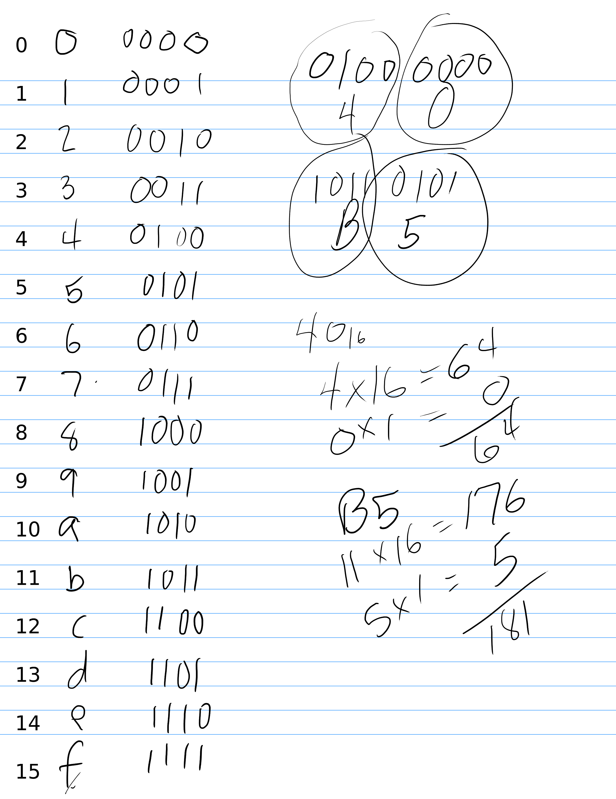
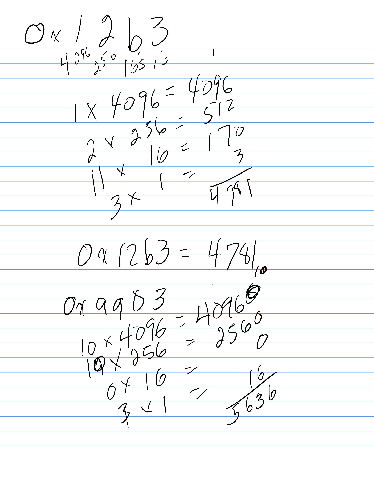

# 01.030 Base 16 Number System (Hexadecimal or Hex)

16 is $2^4$.  That allows us to use Hexadecimal as a shorthand for binary.  

Base 16 is critical to understand.  You need to be able to convert between Base 2 and Base 10 as well as to directly translate between Base 2 and Base 16.  I will also expect you to be able to do conversions between Base 2 and Octal


## Algebra review

* $16^3 = 1 \cdot 16 \cdot 16 \cdot 16 = 4096$
* $16^2 = 1 \cdot 16 \cdot 16 = 256$
* $16^1 = 1 \cdot 16 = 16$
* $16^0 = 1 = 1$

[Link to Binary and Hex Cheatsheet](https://github.com/noynaert/csc264/blob/main/videoNotes/unit01/cheatsheet.pdf)

## Base 162 has 16 digits

The digits are 0, 1, 2, 3, 4, 5, 6, 7, 8, 9, a, b, c, d, e, f  ***There is no symbol for "sixteen."*** As we count, It is OK to use either upper or lower case letters,  I am using lower case because the `as` assembler tends to use lower case.

To represent two we write $10_{16}$ which means 1 group of 2 plus 0.  To represent three we write $11_2$ which means 1 group of 2 plus 1.

## Bytes and Nibbles

On modern computers, a byte is a group of 8 bits.  A group of 4 bytes is called a nibble.  Each hex digit represents a nibble.  Two hex digits represent a byte.


## Assembler Notation

In Mathematics, the base is usually indicated with a subscript for bases other than decimal.  We do not have subscripts on most keyboards. From now on, I will use the notation that the GAS/as assembler uses.  I will write 0x as a prefix. 

Decimal numbers will not have a prefix. 

## Positional Number Systems


$n$ | $2^n$
---|---:
0 | 1
1 | 16
2 | 256
3 | 4096

Let's look at $12b3_{16}$


1 | 2 |b|3
:---:|:---:|:---:|:---:
4092|256|16|1  
$16^3$|$16^2$|$16^1$|$16^0$

```text
     1 ⋅ 4096 = 4096
     2 ⋅  256 =  512
     b ⋅   16 =  170
     3 ⋅    1 =     3
                +____
                  4781

   0x12b3 = 4781
```


