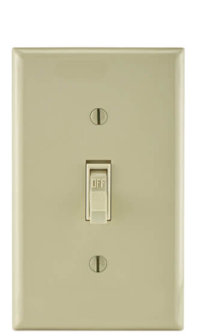
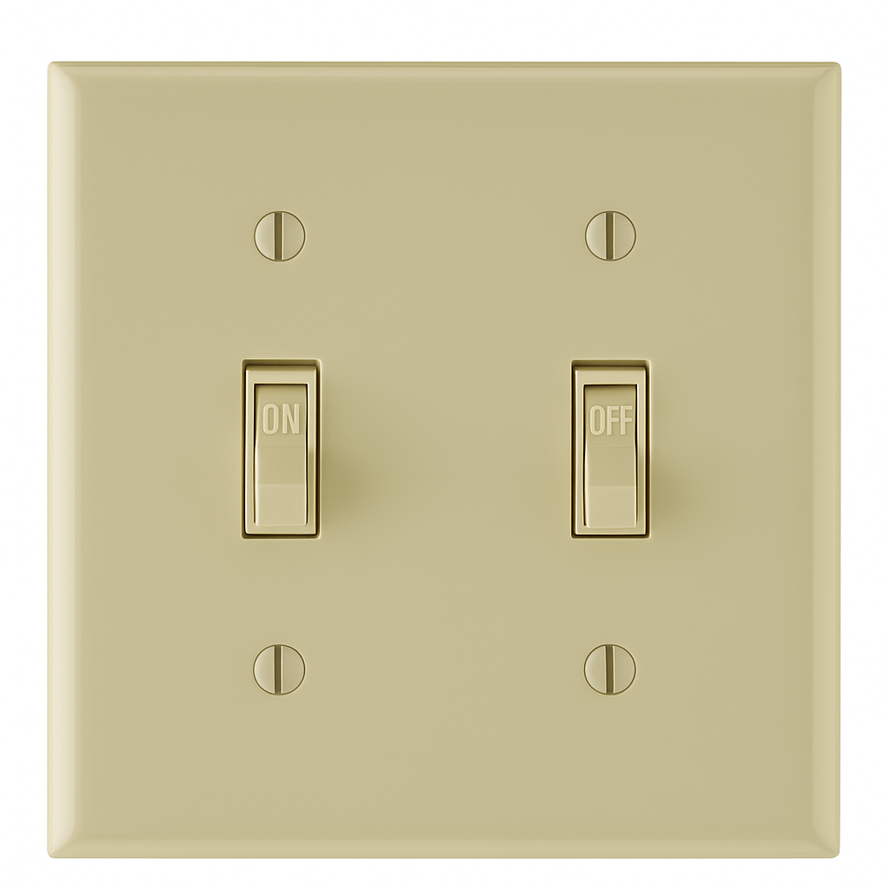
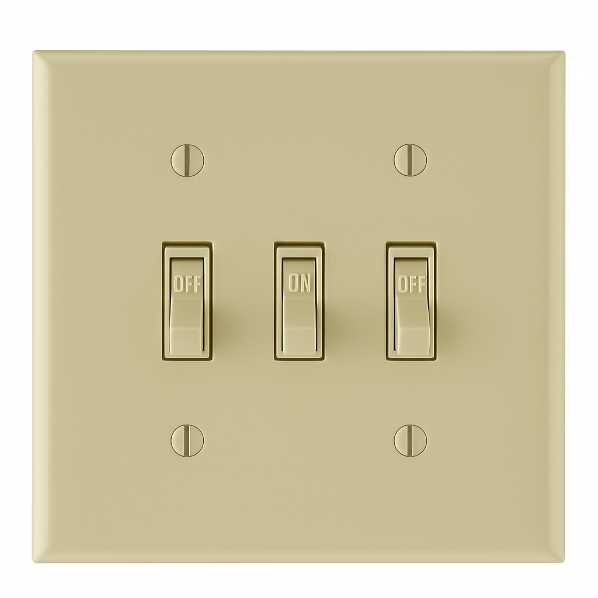

# 01.060 Bit Space

## Communicating with switches

### One Switch, Two Messages

When I came to Missouri Western, I shared an office with George Bishop.  We had a code for our status:

* Off -- I am gone for the day
* On  -- I am around campus somewhere.

### Two Switches, Four Messages

#### and an AI image generation fail

If we had had 2 switches, we could have left 4 messages

* Off, Off, Gone for the day
* Off,  On, Gone for over 1 hour
* On, Off Back within the hour
* On, On Be right back

### Three switches, Eight Messages

#### and a bigger AI image generation fail

* Off, Off, Off Gone for the day
* Off, Off, On  Will be back after class
* Off, On, Off  Gone for more than an hour
* ...
  

## The Formula: $2^n$

If there are n bits, there are $2^n$ unique combinations

## Bit Space

Bit space refers to the number of combinations we have for a given number of bits.  

For example, 8-bit graphics can have 256 colors because $2^8 = 256$.  Or it can have 127 colors and 127 blinking colors.  That only sums to 254.  The other two colors are 0 for black and 255 for "blinking black" but blinking black and black are the same in practice.

There were 20 address lines on an 8086 processor, so it could access $2^20$ memory locations, or 1 megabyte.

However, there were only 16 bits in the registers, so the biggest address the registers could hold was $2^16$ or 640K (65,536).  This was one of the things that made memory addressing so tricky on 8086 processors
