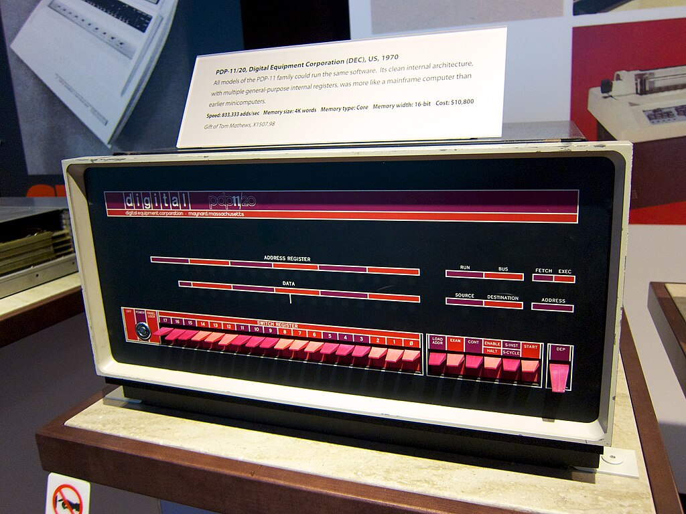

# 01.060 Bytes, Words, Dwords and Quads

## Bytes

On modern computers a Byte is 8 bits.

Byte size is determined by how many bits are needed to hold 1 alphabetic character.

## Byte Size

Historically, there were 6 and 7 byte computer systems.

Consider how many bits are needed to have alphabetic characters in English on a 6-bit computer

* 26 upper case letters
* 10 digits
* 10-ish punctuation marks and special characters
* ~~26 lower case letters~~

$2^6 = 64$  This means we do not have enough bit space for lower case letters.

$2^7 = 128$  Seven bit systems can have upper and lower case, with some space to spare.

Six and Seven bit computers used octal (base 8) for shorthand instead of hex because $2^3 = 8$.  

Octal|Binary
---|---
0|000
1|001
2|010
3|011
4|100
5|101
6|110
7|111

The standard ASCII table uses 7 bits.  $2^7 = 128$ 

The 8th bit could be used for a "parity bit" in data transmission.

There was "extended ASCII" that used 128 characters.

## Word

A word is 2 bytes, or 16 bits.  

Word was significant because a lot of computer systems were built with 16-bit registers

## DWord

DWord is a "Double Word" or 32 bits.  This was important for 80386 processors

## Quad

Quad is 4 words or 64 bits.

### English fail

"Quad" usually means 4, but in x86_64, there are 8 bytes in a quad.  We usually think in bytes instead of words.

