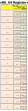

# 02_060 Register Sizes

# Names reflect the size

The names of the registers reflect the size of the register.

* Original 16-bit names Did not have prefixes: `AX`, `BX`, `CX`, `DX`, `IP`, `SP`, `Flags`
* 32-bit names got an "E" prefix: `EAX`, `EBX`, `ECX`, `EDX`, `EIP`, `ESP`, `EFlags`
* 64-bit names got an "R" prefix: `RAX`, `RBX`, `RCX`, `RDX`, `RIP`, `RSP`, `RFlags`
* 
# The "Big 4"

The first four GPR are 

 * `RAX`: accumulator for arithmetic results and return values from functions.
     * `RBX`: often used as a base register.
     * `RCX`: loop counter and parameter passing.
     * `RDX`: I/O pointer and multiplication/division.
  
64-bit systems got another 8 registers `R8`, `R9`, `R10`, `R11`, `R12`, `R13`, `R14`, `R15`.  The are mainly used to hold parameters in some system calls, but are generally safe to assign if you are not using those extended calls.

### Least Sigficant Bits (LSB)

The smaller registers always use the LEAST SIGNIFICANT BITS of the larger registers.

## Parts of the R8 through R15 registers

- `R8`  -- 64-bit
- `R8D` -- 32-bit (dword)
- `R8W` -- 16-bit (word)
- `R8B` -- 8-bit (byte)

Note that in the first 4 GPR it is possible to get to two bytes as `RAH` and `RAL.`   in the R8 through R15 registers, we can only get to the LSB as `R8B`