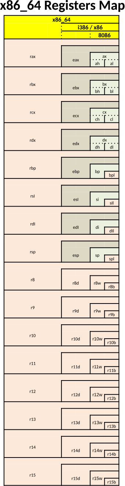

# hmwk02


## Side notes  

* The Register map shown at right is now an official part of the cheatsheet for the first exam. It will also be useful on this assignment.
* I made a video about [clearing registers](https://mwsu.hosted.panopto.com/Panopto/Pages/Viewer.aspx?id=435a65e4-6807-431c-97f0-b35600602801)  I also step through the program in both the kdbg and the gdg debuggers.



Most people have 3 initials.  I will assume for this assignment that people have 2 to 4 initials.  In this assignment we will start with your three initials.  We will isolate the last initial and do a calculation on it that is mildly interesting.

For example, My initials are JEN.  If I look them up in an [ASCII Table](https://www.cs.uah.edu/~rcoleman/Common/Basics/ASCIICharSet.html), I can see that J has an ASCII code of 0x4a.  E has an ASCII code of 0x45, and N has an ASCII code of 0x4E.  I can code this into 3 bytes as 0x4a454e.   (Would it be easier or harder to do this in decimal?)

Notice that we will need up to 4 bytes (32 bits) to hold a set of initials encoded in this manner.

Use the ASCII table to make up the starting number using your own initials.  Use at least 2 initials, but not more than 4.

## The tasks to do

In this assignment, I am going to refer to registers by the 64 bit names, but many of the commands will only be using a portion of the register.  For example, I may talk about the 8 LSB of the rsp register.  If you look at the chart on the right, you can find the rsp register.  The 8 LSB of the rsp register would be the spl.  If I talked about the word part of the r10 register, I would be talking about r10w.

### Task 1

In the data area, create 3 labels as specified below:

* `initials`: 32 bits containing your initials in either hex or decimal (your choice)
* `last`: A byte that is initialized to 0.  It will eventually contain the first letter of your last name.
* `result`: A byte initialized to 0.  It will eventually hold a mildly interesting variation on your last initial.

### Task 2

move your initials into the 32 LSB of the r9 register.  There is a reference table at the bottom of this homework that might help.

### Task 3

Clear all 64 bits of the RAX register by moving a 0 into the rax register

Move the LSB 8 bits of the r9 register into the LSB 8 bits of the rax register.

### Task 4

Add 0x20 (32 in decimal) to the RAX register.  Up until now we have only used `addq`.  You may use `addq` in this case.  If you want to walk on the wild side, try `addb` to only add on the last 8 bits.  (You may use either addq or addb; they should give the same result.)

### Task 5

Move the LSB 8 bits of the rax register to the result in memory.

### Task 6

You need to modify the exit routine.  You will still begin with the following:

```asm
_exit:
  # use syscall to exit and return sum as an exit code.  System.exit(sum)  sys.exit(sum)
  movq $60, %rax
```

Now you need to load result into the rdi.  The problem is that there might be some garbage in the rdi register.  Therefore you need to clear it by moving in 64 bits of 0, and then move result into the 8 LSB of the rsi register.

## Bonus reference material from this week's notes:


bits|.data<br>declaration|mov|original<br>registers|extra<br>8 registers
---:|:---:|:---|:---:|:---:
64|.quad|movq|rcx|r12
32|.long|movl|ecx|r12d
16|.word|mov|cx|r12w
8|.byte|movb|cl<br>ch|r12b

---

## Grading

Submitting the code will be worth 5 points.  Code review will be worth 5 points.  

Turn in your homework by the due date.  Just upload the hmwk02.s file. 

On Monday, Wednesday, and Friday of next week we will have code reviews.  These will be one-on-one meetings with the instructor.  During the code review I will want you to step through your program with a debugger.  You may either use the gdb or the kdbg debugger.