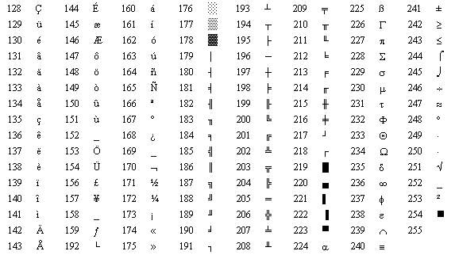

# 03.010 ASCII

ASCII stands for "American Standard Code for Information Interchange."  The "American" becomes significant.

ASCII was developed to standardize transmissions between teletype machines.  They were also being used to communicate with computers.

Originally, it was 7 bits, with one possible parity bit. $2^7$ equals 128, so the codes were from 0 through 127. The IBM-PC expanded ASCII by adding 128 additional characters.

[https://www.cs.uah.edu/~rcoleman/Common/Basics/ASCIICharSet.html](https://www.cs.uah.edu/~rcoleman/Common/Basics/ASCIICharSet.html)

## ASCII codes to know:

| Decimal | Hex | Character |
|:-------:|:---:|:---------:|
| 0       | 0   | (Null)    |
| 32      | 20  | (Space)   |
| 48      | 30  | 0 (Zero)  |
| 64      | 40  | @         |
| 65      | 41  | A         |
| 97      | 60  | a         |
| 126     | 7E  | ~ (tilde) |

## Structure of the ASCII table

The first 32 characters are control characters for teletype machines.  Some of them are still used (you don't need to memorize them).

| Decimal | Hex                  | Control Character |
|:-------:|:--------------------:|:--------------------:|
| 6       | 6                    | ACK (acknowledge)    |
| 8       | 8                    | (BS backspace)       |
| 9       | 9                    | (tab)                |
| 10      | A\|(LF line feed \n) |                      |
| 12      | C                    | (FF form feed)       |
| 13      | D                    | (CR Carriage Return) |
| 27      | 1B                   | (ESC escape)         |

### End of line problem

Computer files used LF (ASCII code 10) to indicate new lines.

Teletypes had a problem.  It took too long to move the carriage to the left margin.  Teletypes added CR (ASCII code 13) to allow time to return the carriage.

Unix systems just used LF, but MS-DOS used both the LF/CR combo.  Things like modern device drivers and web browsers generally fix the problem, but it can still come up when working with files at low levels.

## Weaknesses of ASCII

ASCII works OK for English, specifically American English.

Extended ASCII added characters used in Western European languages that were variations on the Latin alphabet.  It also added box drawing characters and math symbols.

## Unicode and ASCII

Unicode preserves ASCII in its first 127 character positions