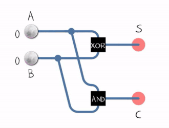

# 03.010 Adders

Consider adding two binary digits.  There are 4 possible combinations of 2 digits.

- $0 + 0 = 0$
- $0 + 1 = 1$
- $1 + 0 = 1$
- $1 + 1 = 10$

The 1+1 produces a "Carry out"

## Adders

### Half-Adders

Reference: [https://en.wikipedia.org/wiki/Adder_(electronics)](https://en.wikipedia.org/wiki/Adder_(electronics))

The black ball represents "true" and the while is "false"