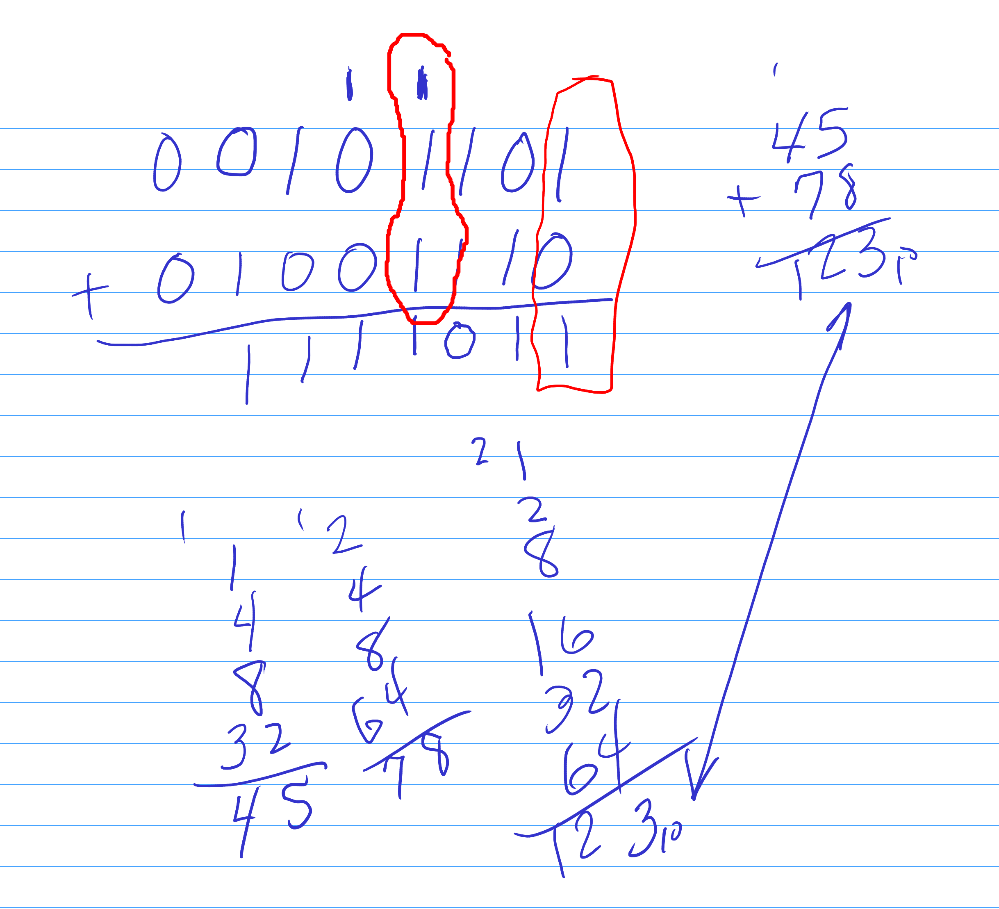
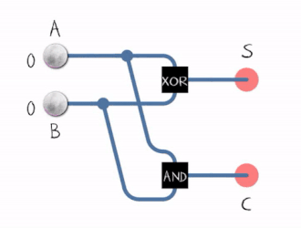
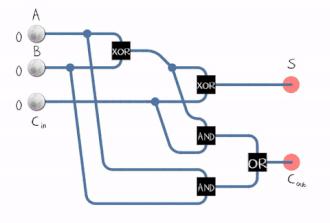

# 03.030 Adders

Consider adding two binary digits.  There are 4 possible combinations of 2 digits.

- $0 + 0 = 0$
- $0 + 1 = 1$
- $1 + 0 = 1$
- $1 + 1 = 10$

The 1+1 produces a "Carry out"

## Half-Adder

Reference: [https://en.wikipedia.org/wiki/Adder_(electronics)](https://en.wikipedia.org/wiki/Adder_(electronics))

A "Half Adder" adds 2 bits.  It does not use the carry-in, but it can produce a carry-out.

A|B|$C_{out}$|S
:--:|:--:|:--:|:--:
0|0|0|0
0|1|0|1
1|0|0|1
1|1|1|0

The only possible outputs from a half-adder are 0, 1, and 2

The black ball represents "true" and the while is "false"

## Full Adder

A full adder adds a carry-in.  A full adder is effectively adding together 3 bits.

Possible outputs are 0, 1, 2, and 3, but we can get them in different ways.

A|B|$C_{in}$|$C_{out}$|S
:---:|:---:|:---:|:---:|:---:|
0|0|0|0|0
0|0|1|0|1
0|1|0|0|1
0|1|1|1|0
1|0|0|0|1
1|0|1|1|0
1|1|0|1|0
1|1|1|1|1

