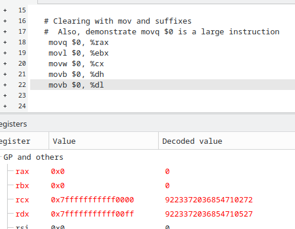

# 03.040 Suffixes

Most arithmetic operations must specify how many bytes they are operating on.  Like the `mov` command, suffixes indicate the size

bytes|meaning|suffix|Example<br>register references
:---:|:---:|:---:|:---:
8|quad|q|rdx,rdi,r9
4|long|l|edx,edi,r9d
2|word|w|ax,di,r9w
1|byte|b|al, ah,dil,rhb

Operations on bytes and words only cover the lower 8 and 16 bits.  Operations on 32 or 64 bits will almost always clear the upper 32 bits.

## Example of suffixes with `mov`

```gas

/* Clearing registers with mov and xor */

.globl _start
.data
  num1:    .quad 0x7fffffffffffffff

.text
_start:
  .globl _start
.data
  num1:    .quad 0x7fffffffffffffff

.text
_start:
    # fill registers with markers
    movq num1, %rax
    movq num1, %rbx
    movq num1, %rcx
    movq num1, %rdx

   # Clearing with mov and suffixes
   #  Also, demonstrate movq $0 is a large instruction
    movq $0, %rax
    movl $0, %ebx
    movw $0, %cx
    movb $0, %dh
    movb $0, %dl
```



## Why the difference between 32-bit and 64-bit are handled

The designers of the CPU chip decides whether changes to low order bits will propogate to high order bits.  It requires extra circuitry to keep the smaller version of the commands limited to 8 or 16 bits.

The designers of the Intel chip were focused on C and the way it handles small integers.  The preserved isolation in the 8 and 16 bit segments, but allow 32 bit changes to propogate.

This has to do with the way negative numbers are represented in binary.