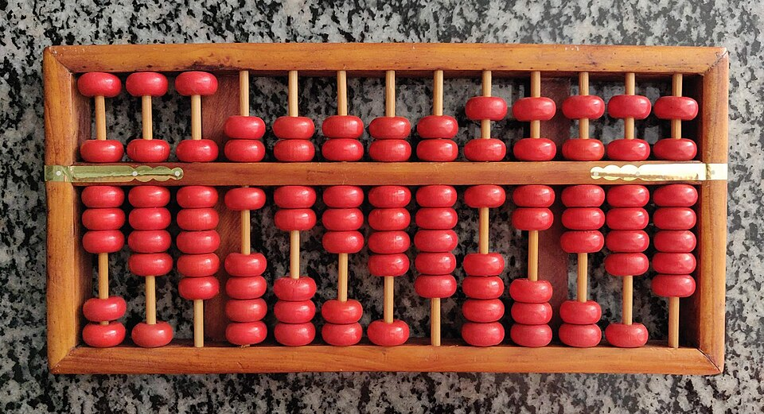
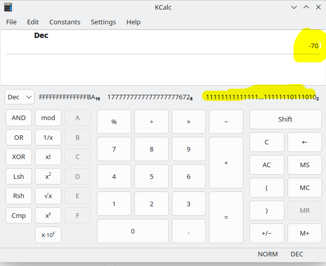
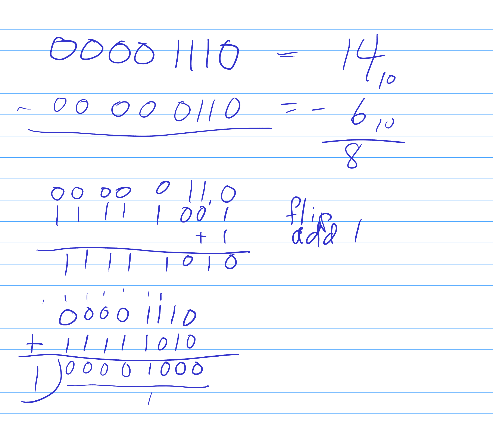

# 03.070 Two's Compliment

In western schools, we usually teach subtraction as different than addition.  Students learn subtraction tables.  

Much of Asia does subtraction using a different basis.  They tend to use a base 5ish system for things like the Abacus.  It does subtraction using something called "Compliment Arithmetic."

In compliment arithmetic, ***subtraction is done by adding.***  We add the "compliment" of the number being subtracted.

## Ten's compliment

The ten's compliment of a number is the number you would need to add to it in order to get 10.  For example, the compliment of 7 would be 3.   The complement of 2 would be 8.

Another way to look at the 10's compliment is an old car odometer.  Assume that the odometer rolls backwards when the car backs up.

If the car begins a trip with the odometer at `000000` and then it backs up for 2 miles.  It will now show `999998`   Note that it is impossible to know by just looking at the odometer whether the 999998 means the car has backed up for two miles or it has gone forward for 999998 miles.  It would be up to the driver of the vehicle or some independent source to keep track of how to interpret the number.

## Computers use 2's compliment for subtraction

Using two's compliment allows using the existing adders and bitwise operators instead of needing separate "subtractors"

### Converting a binary number to its 2's compliment

The 2's compliment must operate with a fixed number of bits.  In this case, we will use 8 bits.

The rule to convert to 2's compliment is "Flip the bits, and add 1"

```text

Original number:  01000110

Flip the bits:    10111001
Add 1:                  +1
Two's Compliment: 10111010
```


### Sign Bit

The left bit ends up being a "sign bit."  A 1 in the leftmost position indicates a negative number.

Notice how the 1 propagates to the left.

### Converting out of 2's compliment

Use exactly the same algorithm to convert out of 2's compliment.  "Flip the bits and add 1"

```text
Two's Compliment: 10111010

Flip the bits:    01000101
Add 1                   +1
Value is          01000110
```

## Signed vs Unsigned Numbers

* The CPU does not know whether the numbers are signed or unsigned.
* It is usually up to the programmer to keep track of whether a number is signed or unsigned
* It is possible to examine the flag bits to determine if something is signed or unsigned.

### Bit Space

If an integer is signed, you give up half the bit space.

# Java and C++ signed integers

* byte
    * $2^8$ is 256, so 0 - 255 would be available if unsigned
    * Range is actually -128 to 127
* short
    * 2^16 is 65536
    * Range is actually -32768 to 32767

Notice that 0 is effectively a positive number in this system.

## Subtracting using 2's compliment

