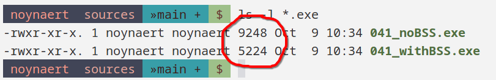

# 06.040 New Syntax (for Input)

## We need space

So far, when we have done output we have defined the string in advance.  However, input needs space defined, but we don't know what that content will be (sometimes that happens for output as well).

## `.skip`

The `.skip` directive reserves space.  It takes an argument, which is the number of bytes to allocate.  examples are shown below.

```
.data

info: .asciz "Hi"
blank: .skip 50 #reserves 50 bytes
nothing: .skip 50, 0 #reserves 50 bytes and initializes to "0"
lotsOfA: .skip 50, 10 #reserves 50 bytes and intitializes to "10"
```
The above results in the following listing:

```
 5              	.data
   6 0000 486900   	     info:    .asciz "Hi"
   7 0003 00000000 	     blank:   .skip 50      #reserves 50 bytes
   7      00000000 
   7      00000000 
   7      00000000 
   7      00000000 
   8 0035 00000000 	     nothing: .skip 50, 0   #reserves 50 bytes and initializes to  "0"
   8      00000000 
   8      00000000 
   8      00000000 
   8      00000000 
   9 0067 0A0A0A0A 	     lotsOfA: .skip 50, 10  #reserves 50 bytes and intitializes to "10"
   9      0A0A0A0A 
   9      0A0A0A0A 
   9      0A0A0A0A 
   9      0A0A0A0A 
```
# BSS

Large buffers are often put in the `.bss` section of a program. The `.bss` section is used for uninitialized global and static variables, which allows the program to allocate large amounts of memory without increasing the size of the executable file.

Data in the .bss section cannot be initialized.  This means the second parameter of .skip will be ignored if it is present.

The advantage of using the .bss section is that the .bss is not saved in the executable file (it is created at run time).  Therefore the size of the executable file will be smaller.

The following executable file had a 4096 buffer.  In the "noBss" file it was created in the .data section.  In the "withBSS" file, it was moved to the .bss section.  It has a significant impact on the size of the executable file.

