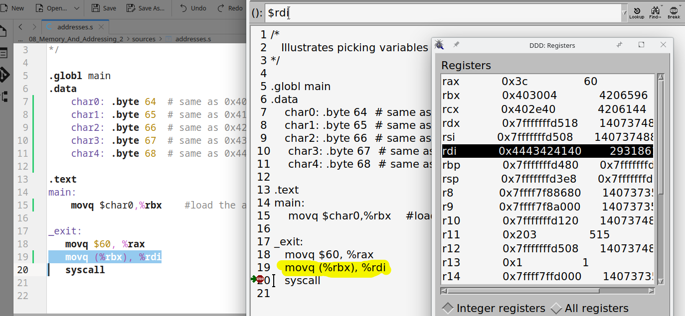
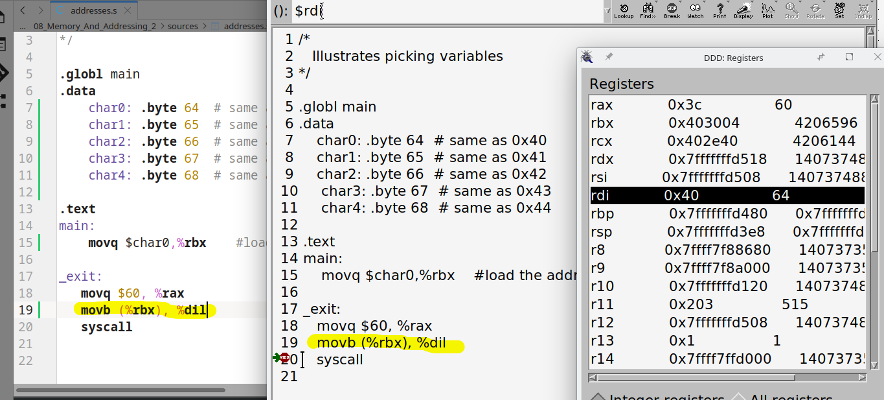

# 08.010 Memory

Every byte of memory has a unique id number.  The id numbers increase sequentially.  We call the id number of a memory location its ***address***.

## "Variables"

What we call variables are just labels.  They are just conveniences for programmers because most people are better with words than numbers.  The labels also remain unchanging.

## Complimentary operations

### $ before a label

When we put a $ before a label, it means "address of"

```
   movq $char0, $rbx  # Load the ADDRESS OF char0 into $rbx
```

### () around a register

When we put () around a register reference, we mean to get the value at the address stored in the register.

```
   movb (%rbx), %dil # Load the byte pointed to by the address in rbx to the
                     # low 8 bits of rdi
```

## `movq` vs `movb`

`movq` moves 8 bytes.   Notice the `%rdi` holds the data in char0 through char 4 in reverse .  (In this case there were only 5 bytes of `.data`, so only 5 bytes were moved)



`movb` moves  byte.  Notice that the %dil hold only the data from char0


