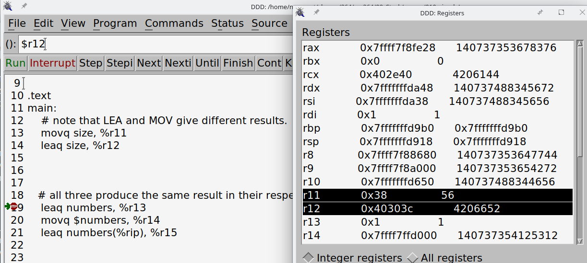
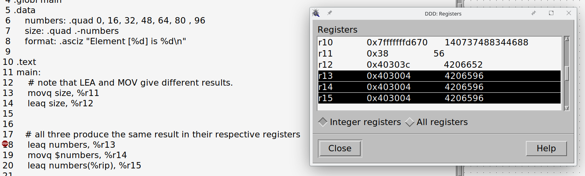

09.010 LEA

LEA means "Load Effective Address"

It is basically a variation on the formula from last week:

$address = VALUE(BASEREG, IDXREG, MULTIPLIER)$
LEA takes the usual q, d, w, b suffixes

The syntax is

```
lea VALUE(BASEREG, IDXREG, MULTIPLIER), %REGISTER
```

- **VALUE*** (or ***OFFSET***) may be either a label or a constant
- **\*BASEREG** and **_IDXREG_** are registers
- Multiplier is 1, 2, 4, or 8

The `lea` instruction just loads the address into the register without accessing memory.

## `lea` vs `mov`

The `mov` instruction, on the other hand, copies the value from one location to another, potentially accessing memory. This means that `mov` can be used to transfer data, while `lea` is used for address calculations.

```
.data
    numbers: .quad 0, 16, 32, 48, 64, 80 , 96
    size: .quad .-numbers

.text
    movq size, %r11  # moves 56 to register
    leaq size, %r12  # moves the address where the 56 is stored into the register.
```



Note that the above code is equivalent to the following:

```
    movq size(,,1), %r11
    leaq size(,,1), %r12
```

## Equivalent Instructions

```
  # all three produce the same result in their respective registers
    leaq numbers, %r13   # uses lea to load the address
    movq $numbers, %r14  # Uses the $ to load the address
    leaq numbers(%rip), %r15 # uses rip-relative addressing to load the address
```

RIP Relative addressing gives the same results because the GNU GAS assembler defaults to RIP-relative addressing for memory references in 64-bit mode.

```
    # all three produce the same result in their respective registers
    leaq numbers, %r13
    movq $numbers, %r14
    leaq numbers(%rip), %r15
```


