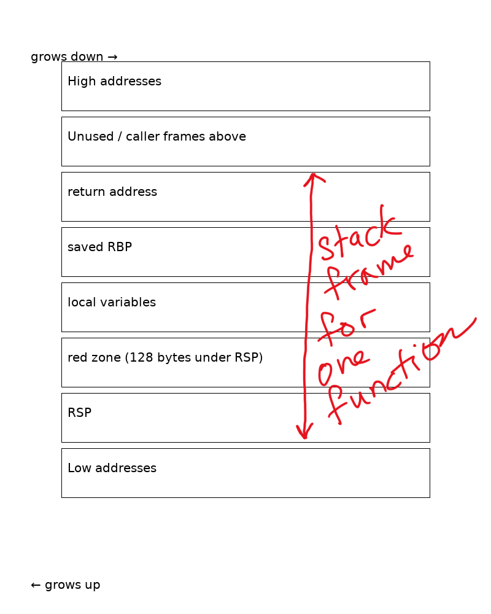

# Stack Frames and Stack Structure in x86-64

The x86-64 stack is a region of memory used for temporary data storage, particularly during function calls. It follows a Last-In, First-Out (LIFO) principle and is managed by the RSP (Stack Pointer) and RBP (Base Pointer) registers.

Here's a breakdown of its structure and operation:
- Stack Growth Direction: On x86-64, the stack grows downwards in memory, meaning that as data is pushed onto the stack, the RSP register (which points to the "top" or lowest address of the stack) decreases.
- Stack Frames: Each function call creates a "stack frame" on the stack. This frame contains:
  - Return Address: The address of the instruction in the calling function to return to after the current function finishes.
  - Saved RBP: The value of the RBP register from the calling function, saved to allow restoring the caller's stack frame.
  - Local Variables and Temporary Data: Space for variables declared within the function and any intermediate values needed during its execution.
  - Arguments (for some calling conventions): While the first few arguments are typically passed in registers, any remaining arguments are pushed onto the stack.

## Registers:
- RSP (Stack Pointer): Points to the current top of the stack (the lowest memory address currently in use by the stack).
- RBP (Base Pointer): Often used as a stable reference point to the beginning of the current stack frame, allowing easy access to local variables and arguments via offsets.

## Stack Alignment

 The x86-64 System V ABI (Application Binary Interface) mandates that the stack pointer (RSP) must be 16-byte aligned before a call instruction. This ensures optimal performance for certain instructions.
## Push and Pop Operations:
 - PUSH: Decrements RSP by 8 bytes (for 64-bit values) and then stores the value at the new RSP address.
 - POP: Retrieves the value from the memory address pointed to by RSP, and then increments RSP by 8 bytes.
