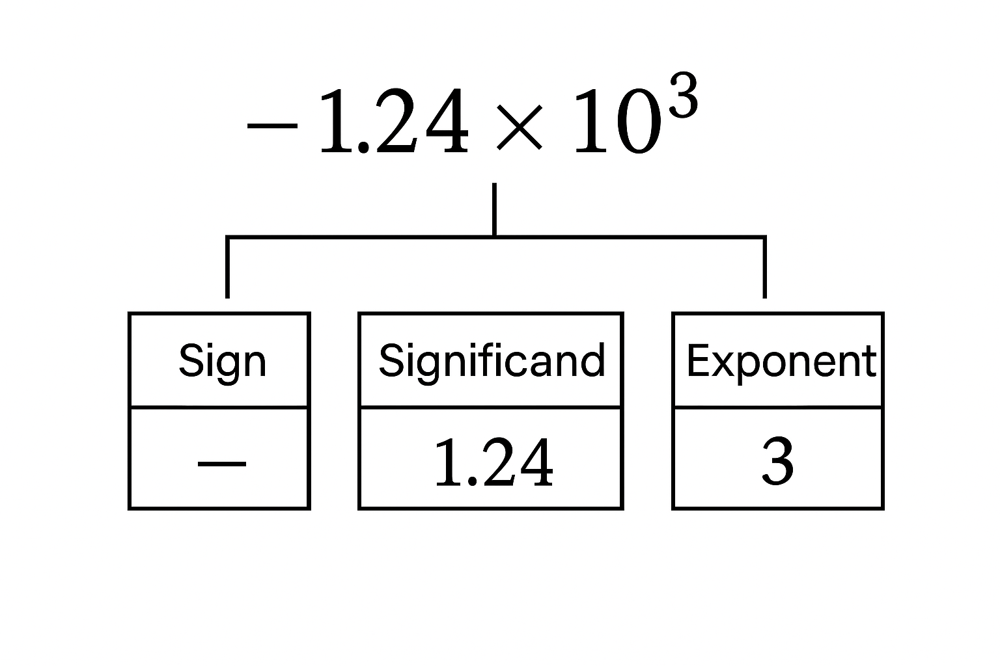
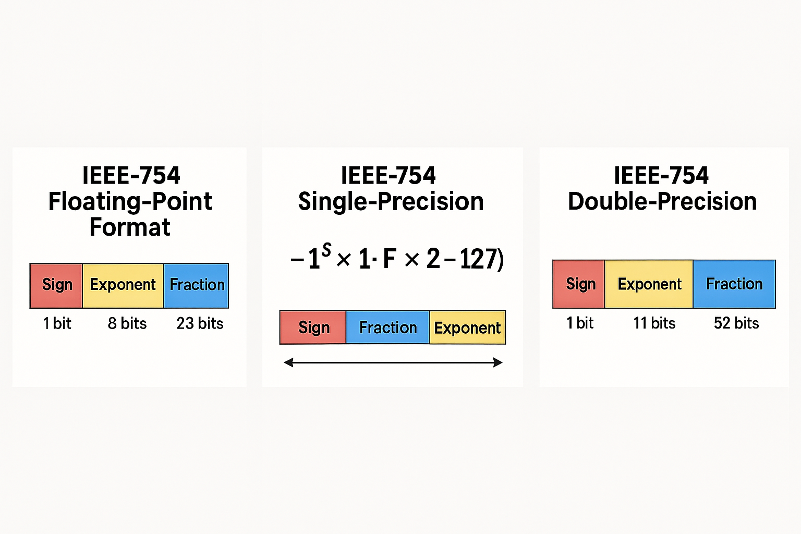

#  12.030 -- IEEE 754 Standard for Floating Point Representation

The IEE 754 standard was adopted in 1985.  It is the most widely used standard for representing floating point numbers in computers.  The standard defines several formats for representing floating point numbers, including single precision (32 bits), double precision (64 bits), and extended precision (80 bits).  

There were major revisions to the standard in 2008 and 2019 to add new features and improve existing ones.

## Review of Scientific Notation

Normal Representation|Scientific Notation
:---:|:---:
$4500$|$4.5 \times 10^3$
$0.0045$|$4.5 \times 10^{-3}$
$123000000$|$1.23 \times 10^8$
$0.000123$|$1.23 \times 10^{-4}$
$1.5$|$1.5 \times 10^0$
$-0.75$|$-7.5 \times 10^{-1}$
$.00124$|$1.24 \times 10^{-3}$

The scientific natation may be broken into three parts: the sign, the significand (or mantissa), and the exponent. 

### Scientific Notation vs Floating Point Representation.

Scientific notation normally has 1 digit to the left of the decimal.  In Floating Point representations, the decimal is moved one more place to the left so all of the significant digits are to the right of the decimal

Scientific Notation|Floating Point Representation
:---:|:---:
$4.5 \times 10^3$|$0.45 \times 10^4$
$1.23 \times 10^8$|$0.123 \times 10^9$
$1.5 \times 10^0$|$0.15 \times 10^1$
$-7.5 \times 10^{-1}$|$-0.75 \times 10^0$
$1.24 \times 10^{-3}$|$0.124 \times 10^{-2}$

In addition, floating point representation uses a biased exponent.  This means that a fixed value is added to the actual exponent to get the stored exponent.  This allows for both positive and negative exponents to be represented without using a separate sign bit for the exponent.

Also, obviously, floating point representation is done in binary rather than decimal.  This means that the significand and exponent are represented using base 2 rather than base 10.

## The IEEE 754 Standard

The IEEE 754 standard is the most widely used standard for representing floating point numbers in computers. It was established in 1985 by the Institute of Electrical and Electronics Engineers (IEEE) to provide a consistent and reliable way to represent real numbers in binary format. The standard defines several formats for representing floating point numbers, including single precision (32 bits), double precision (64 bits), and extended precision (80 bits).

## Exponent Bias

The exponent in IEEE 754 floating point representation is stored using a biased exponent. This means that a fixed value, known as the bias, is added to the actual exponent to get the stored exponent. The bias allows for both positive and negative exponents to be represented without using a separate sign bit for the exponent.

| Format                        | Exponent Bits | Bias     |
| ----------------------------- | ------------- | -------- |
| **Single precision (32-bit)** | 8             | **127**  |
| **Double precision (64-bit)** | 11            | **1023** |

Actual Exponent|Stored Exponent (with Single Precision Bias)
:---:|:---:
$2^0$ (exponent is 0)|$127$ is stored
$2^3$ (exponent is 3|$130$ is stored
$2^{-2} (exponent is -2$)|$125$ is stored

